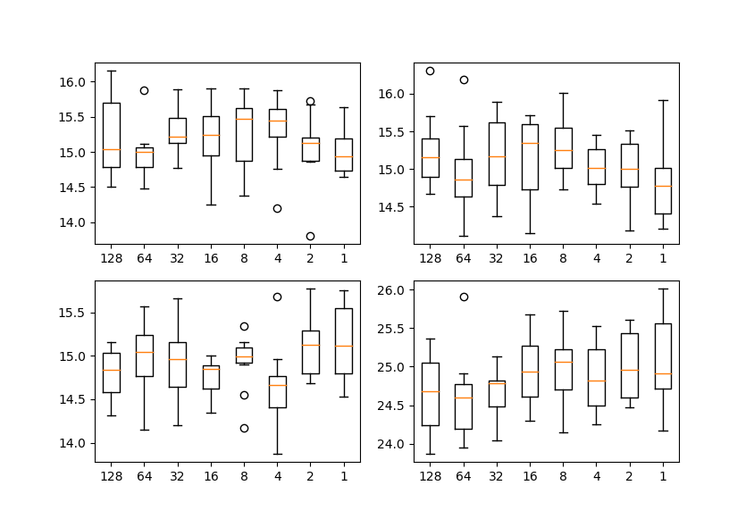
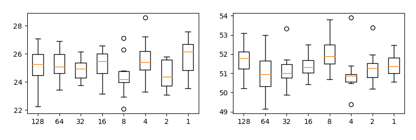
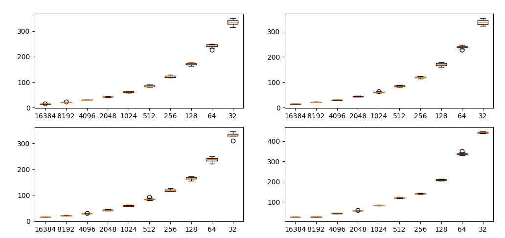
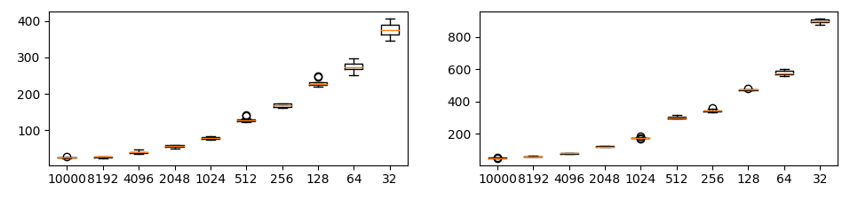
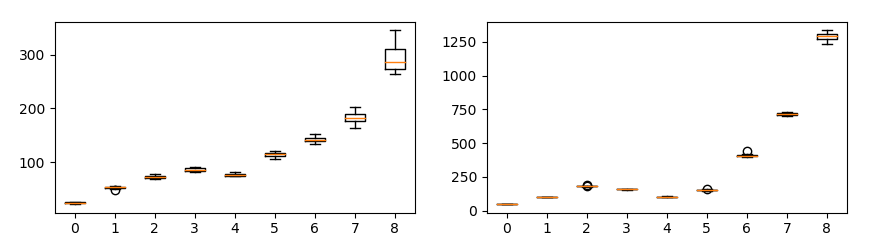
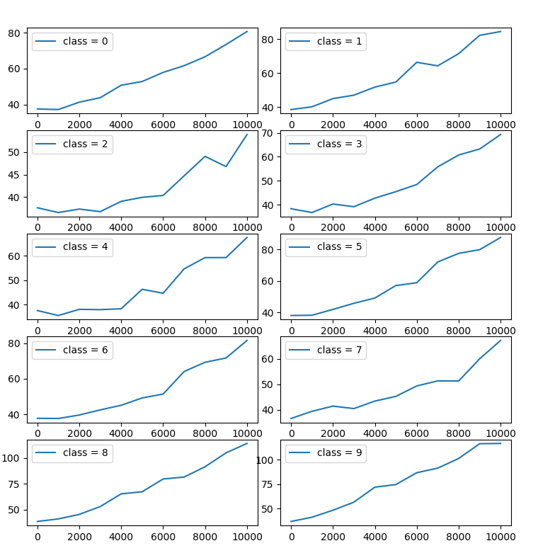
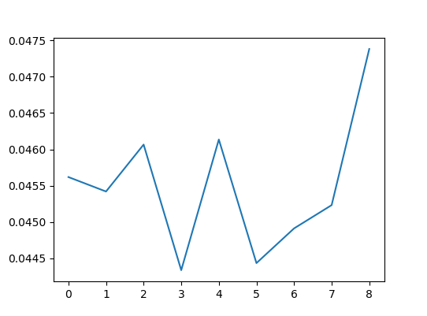

# Sliced Wasserstein Distance (SWD) in PyTorch
An implementation of Sliced Wasserstein Distance (SWD) in PyTorch. **GPU acceleration is available**.

SWD is not only for GANs. **SWD can measure image distribution mismatches or imbalances  without additional labels.**

## About
Original idea is written in [PGGAN paper](https://arxiv.org/pdf/1710.10196.pdf). This repo is an unofficial implementation.

[Original code](https://github.com/tkarras/progressive_growing_of_gans) is for Numpy. But this repo's code is for PyTorch, so you can calculate SWD on CUDA devices.

## How to use
A simple example of calculating SWD on GPU.

```python
import torch
from swd import swd

torch.manual_seed(123) # fix seed
x1 = torch.rand(1024, 3, 128, 128)  # 1024 images, 3 chs, 128x128 resolution
x2 = torch.rand(1024, 3, 128, 128)
out = swd(x1, x2, device="cuda") # Fast estimation if device="cuda"
print(out) # tensor(53.6950)
```

## Japanese article
PyTorchでSliced Wasserstein Distance (SWD)を実装した  
[https://blog.shikoan.com/swd-pytorch/](https://blog.shikoan.com/swd-pytorch/)

## Parameter details
Detail information of ```swd``` paramters.

* ```image1, image2``` : **Required** 4rank PyTorch tensor. Each tensor shapes are [N, ch, H, W]. Square size(H=W) is recommended.
* ```n_pyramid``` : (Optional) Number of laplacian pyramids. If ```None```(default : same as paper), downsample pyramids toward 16x16 resolution. Output number of pyramids is ```n_pyramid + 1```, because lowest resolution gaussian pyramid is added to laplacian pyramids sequence.
* ```slice_size``` : (Optional) Patch size when slicing each layer of pyramids. Default is 7 (same as paper).
* ```n_descriptors```: (Optional) Number of descriptors per image. Default is 128 (same as paper).
* ```n_repeat_projection``` : (Optional) Number of times to calculate a random projection. **Please specify this value according your GPU memory.** Default is 128.  ```n_repeat_projection * proj_per_repeat = 512``` is recommended. This product value 512 is same as paper, but official implementation uses 4 for n_repeat_projection and 128 for proj_per_repeat. (This method needs huge amount of memory...)
* ```proj_per_repeat``` : (Optional) Number of dimension to calculate a random projection on each repeat. Default is 4. Higher value needs much more GPU memory. ```n_repeat_projection * proj_per_repeat = 512``` is recommended.
* ```device``` : (Optional) ```"cpu"``` or ```"cuda"```. **Please specify ```cuda``` when uses gpu acceleration.** Default is ```"cpu"```.
* ```return_by_resolution``` : (Optional) If True, returns SWD by each resolutions (laplacian pyramids). If False, returns the average  of SWD values ​​by resolution. Default is False.
* ```pyramid_batchsize``` : (Optional) Mini batch size of calculating laplacian pyramids. Higher value may cause CUDA out of memory error. This value does not affect on SWD estimation. Default is 128.


## Experiments
### Changing n_repeat_projection and proj_per_repeat
**Changing ```n_repeat_projection``` and ```proj_per_repeat``` has little effect swd** (if n_repeat_projection * proj_per_repeat is constant). 

Each plot shows SWD value by resolution of laplacian pyramid. Horizontal axis is proj_per_repeat and vertical axis is SWD. Each condition is run 10 times.

In all conditions, n_repeat_projection * proj_per_repeat is fixed at 512.

#### Random noise
Compares 16384 different two random tensors.



#### CIFAR-10
CIFAR-10 compares 10k training data with 10k test data.



So, you can change ```n_repeat_projection``` and ```proj_per_repeat``` values according GPU memory.

### Changing the number of data
**Changing the number of data has a huge impact on SWD (important)**.

Each plot shows SWD value by resolution of laplacian pyramid. Horizontal axis is number of data and vertical axis is SWD. Each condition is run 10 times.

#### Random noise


#### CIFAR-10


It is important to fix the number of samples initially. If the number of samples changes, SWD returns incorrect result.

## As a metric for distribution-mismatch
**SWD can be used as a metric of distribution mismatch.**

2 experiments on CIFAR-10. Measure SWD between training and test data in following conditions:

1. **Remove classes** : Test data is without changing, while training data is deleting 0-8 classes.
2. **Inbalanced classes** : Test data is without changing, while training data create imbalances artificially :  
Training A is data removed 1 class from whole training set (inbalanced set). Training B is changing nothing (balanced set).  
A and B are concatenated with a size of 0-10000, and only 1 class create unbalanced data.

Experiment 1 and 2 are also imbalanced data, but 1 produces a stronger imbalance or distribution mismatch.

### 1. Remove classes

Each plot shows SWD value by resolution of laplacian pyramid. Horizontal axis is number of removed classes and vertical axis is SWD. Each condition is run 10 times.



As more classes are deleted, higher SWD are observed.

### 2. Inbalanced classes

Each plot shows SWD value by index of unbalanced classes. Horizontal axis is number of inbalanced set(training A) and vertical axis is SWD. Each condition is run once.



This is a weaker imbalance than experiment 1, but SWD can capture this imbalance or mismatch.

### (Optional) Compare to SSIM
One thing that concerned is whether this kind of imbalance can be detected by other indicators (e.g. SSIM). Run experiment 1 with SSIM.



SSIM don't detect imbalances well. 

Therefore, It can be confirmed that SWD is effective for mismatch detection.